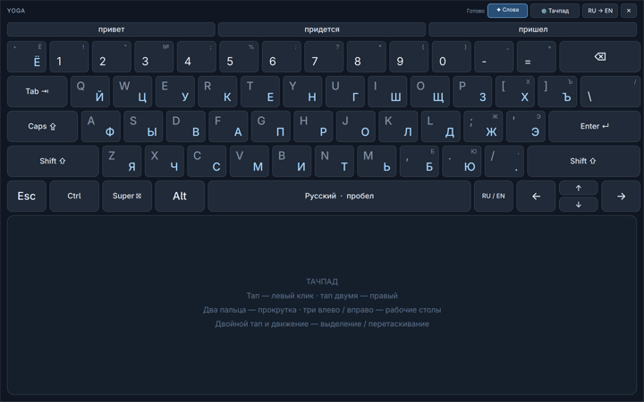

# Yoga Panel: клавиатура и тачпад для Yoga Book 9

Экранная RU/EN-клавиатура сверху и тачпад во всю оставшуюся ширину нижнего
экрана. Разработано и проверено на Lenovo Yoga Book 9 13IRU8 (82YQ),
Omarchy / Hyprland 0.56.2, с нижним экраном `eDP-2`.



## Возможности

- Компактная верхняя строка: настройки, язык и закрытие.
- Обе раскладки видны одновременно: EN сверху слева, RU снизу справа.
  Активный язык подсвечен. Стандартные смещения рядов, широкие Enter/Backspace,
  Caps Lock, два Shift, отдельный блок стрелок. Shift учитывает русские знаки
  препинания, а Caps+Shift даёт строчные буквы.
- **Alt+Shift** в любом порядке на экранных клавишах меняет язык и в системе.
  Системные уведомления о раскладке обновляют панель; пробел и Backspace
  сохраняют выбранную группу, не переключая RU в EN.
- **✦ Слова** включает три офлайн-подсказки по префиксу от двух букв.
  Выбранное слово дописывается с пробелом; автоматической замены нет.
  Настройка сохраняется. В комплекте RU/EN словари по 50 тысяч слов (~1,6 МБ).
- Ctrl, Alt, Shift и **Super ⊞**: нажать модификатор, затем нужную клавишу.
  Можно комбинировать, например Super → Shift → Tab. Модификаторы сбрасываются
  после ввода. Super → 3 переключает на рабочий стол 3.
- Один палец — указатель; тап — левый клик.
- Тап двумя пальцами — правый клик; движение двумя — прокрутка.
  Режим прокрутки держится до отпускания пальцев. Мелкое обратное движение
  при отрыве фильтруется, после отпускания отправляется Wayland axis_stop.
- Тап, затем второе касание с удержанием и движением — выделение / перетаскивание.
  Отрыв пальца или отмена освобождает кнопку мыши.
- Свайп тремя пальцами влево — следующий рабочий стол, вправо — предыдущий,
  как Super+Tab / Super+Shift+Tab в Omarchy. Переключение один раз при отпускании.
- Кнопка `⚙ Тачпад`: скорость, ускорение, прокрутка. Сохраняются в
  `~/.config/yoga-panel/settings.json`. 0 ускорения означает постоянную скорость.
- Закрытую панель открывает нижний ярлык или короткий тап тремя пальцами.
- Отдельная служба синхронизирует яркость обоих дисплеев, включая изменения
  через системную панель. Основной источник — `intel_backlight`.

## Установка

Сначала примените соответствующие вашему устройству настройки экранов и сенсоров
из [основного README](../README.md). Здесь ожидаются `eDP-1` сверху, `eDP-2` снизу.
Не применяйте конфигурацию 82YQ к другой модели без проверки.

Необходимы работающие Hyprland и Quickshell, Python 3, `brightnessctl`, GCC/G++,
`pkg-config`, `wayland-scanner`, заголовки Hyprland, Wayland, libinput, libdrm,
pixman и libxkbcommon. На Arch зависимости сборки обычно доступны через
`base-devel`, `hyprland`, `wayland`, `libinput`, `libdrm`, `pixman`, `libxkbcommon`.
Node.js нужен только для тестов жестов.

```bash
git clone https://github.com/gon7187/Omarchy-LenovoYogaBook9.git
cd Omarchy-LenovoYogaBook9
python3 yoga-panel/install.py --dry-run
python3 yoga-panel/install.py
~/.local/bin/yoga-panel show
```

Установщик собирает код до замены установки. Исходники и собранные помощники
попадают в `~/.local/share/yoga-panel`, команды — в `~/.local/bin`, две службы —
в `~/.config/systemd/user`. Заменяемые файлы сохраняются в
`~/.local/state/yoga-panel/backups/`. Root не требуется; установщик не ставит
пакеты и не меняет права устройств ввода, ядро, прошивку или загрузчик.
`--no-start` устанавливает и включает автозапуск, но не запускает службы сейчас.

## Обновления и диагностика

Плагин сверяет ABI с работающим Hyprland. При запуске служба проверяет, что он
действительно загружен; при отказе один раз пересобирает его. Изменение API может
потребовать правки исходников. Если пакеты обновлены, но сеанс ещё работает со
старыми библиотеками, может потребоваться выход и повторный вход.

```bash
hyprctl plugin list
journalctl --user -u yoga-panel.service -n 40
quickshell ipc -p ~/.local/share/yoga-panel call panel touchStatus
systemctl --user status yoga-brightness-sync.service
```

Счётчики диагностики не записывают набранный текст. Соединение панели с
помощниками идёт через приватный stdin; сетевого сервера нет.

Подсказки работают только с префиксом, набранным на этой панели. Текст приложений
не читается, история и персональный словарь не сохраняются. Префикс сбрасывается
при смене окна, языка, навигации и движении тачпада; через 8 секунд без ввода
подсказка больше не вставляется. Изменение позиции курсора внешней мышью внутри
того же поля не всегда обнаруживается — окружение текста через Wayland здесь
не доступно. В полях, где подсказки не нужны, выключайте **✦ Слова**.

## Проверки

```bash
cd yoga-panel
bash build.sh
bash build-gesture.sh
node test_touchpad.cjs
node test_layout.cjs
python3 -m unittest discover -p test_prediction.py
python3 -m py_compile backend.py ensure-plugin.py install.py
```

Тесты покрывают правый клик, прокрутку с разновременными событиями пальцев,
лишний неподвижный контакт, двойной тап с перетаскиванием, отмену, ускорение,
трёхпальцевые свайпы и модификаторы Super. Сборка также запускает тест распознавания
жеста открытия. `python3 test_keyboard.py` — интерактивная проверка RU/EN в своём
тестовом поле; временно забирает фокус.

На устройстве пользователь подтвердил движение одним пальцем и прокрутку двумя.
Новые свайпы, сочетания Super и последние изменения прокрутки проверены
программно; команды рабочих столов проверены в живом сеансе. Полная проверка
жестов пальцами, после сна и при смене ориентации ещё нужна. Это прототип,
а обработка ладони — эвристика, не полноценный драйвер palm rejection.

Двуязычные клавиши проверены вводом в отдельное поле. Alt+Shift проверен реальными
кнопками панели в обоих порядках. Полный путь подсказки «при» → «привет» проверен
через QML, словарь и виртуальный ввод. Отдельно проверено, что RU → пробел →
Backspace → RU не порождает событие перехода в английскую раскладку.

## Отключение / удаление

```bash
~/.local/bin/yoga-panel stop
systemctl --user disable --now yoga-panel.service yoga-brightness-sync.service
```

После остановки можно удалить `~/.local/share/yoga-panel`, две установленные
команды и два unit-файла, затем выполнить `systemctl --user daemon-reload`.
Сохранённые настройки и резервные копии остаются отдельно.

## Происхождение

Основа настройки ноутбука — [pybe/Omarchy-LenovoYogaBook9](https://github.com/pybe/Omarchy-LenovoYogaBook9).
Исходная документация и настройки сохранены в корне форка.
Панель, обработчик касаний и тесты добавлены в этом форке.
Wayland XML взяты из wlr-protocols / wtype; их лицензии сохранены в файлах.
Лицензия в этой папке относится к новому коду панели, а не к исходному репозиторию.

Словари: [hermitdave/FrequencyWords](https://github.com/hermitdave/FrequencyWords),
зафиксированная версия, **CC BY-SA 4.0**. Данные не покрываются MIT-лицензией кода.
Точные источники, контрольные суммы и авторство — в [data/ATTRIBUTION.md](data/ATTRIBUTION.md).
