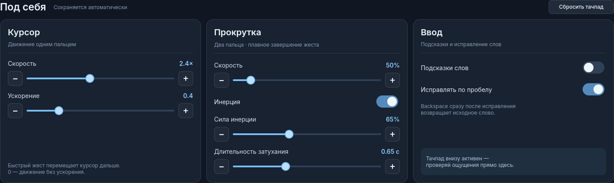

# Yoga Panel: клавиатура и тачпад для Yoga Book 9

Экранная RU/EN-клавиатура сверху и тачпад во всю оставшуюся ширину нижнего
экрана. Разработано и проверено на Lenovo Yoga Book 9 13IRU8 (82YQ),
Omarchy / Hyprland 0.56.2, с нижним экраном `eDP-2`.

## Возможности

- Компактная верхняя строка: слова, настройки и закрытие. Esc стоит перед Ё. Язык переключается Alt+Shift или кнопкой RU/EN в нижнем ряду.
- Обе раскладки видны одновременно: EN сверху слева, RU снизу справа.
  Активный язык подсвечен. Стандартные смещения рядов, широкий Enter,
  Caps Lock, два Shift, отдельный блок стрелок. Shift учитывает русские знаки
  препинания, а Caps+Shift даёт строчные буквы.
- **Alt+Shift** в любом порядке на экранных клавишах меняет язык и в системе.
  Системные уведомления о раскладке обновляют панель; пунктуация, пробел и Backspace
  сохраняют выбранную группу, не переключая RU в EN.
  Кнопка RU/EN срабатывает один раз по завершении тапа; скользящие касания отменяются. Повторные системные
  уведомления не сбрасывают модификаторы; подтверждения переключений защищают
  от запоздавших событий, в том числе после голосового ввода.
- **Слова** показывает или скрывает три офлайн-подсказки по префиксу от двух букв.
  Подсказки занимают свободное место верхней строки между YOGA и кнопками;
  клавиатура и тачпад при переключении не сдвигаются. Надпись «Готово» скрыта.
  Автоисправление включается отдельно в **Настройки → Автоисправление по пробелу**
  и работает даже при скрытых подсказках. Уверенное исправление применяется по пробелу;
  ближайший Backspace возвращает исходное слово. Повторный пробел после отмены
  оставляет его как есть. Неоднозначные варианты выбираются вручную.
  Настройка сохраняется. В комплекте RU/EN словари по 50 тысяч слов (~1,6 МБ).
- Ctrl, Alt, Shift и **Super 🚀**: нажать модификатор, затем нужную клавишу.
  Можно комбинировать, например Super → Shift → Tab. Модификаторы сбрасываются
  после ввода. Super → 3 переключает на рабочий стол 3.
- **🎤 справа от пробела**: держать для записи системной диктовки Voxtype,
  отпустить для распознавания. Отмена касания или завершение панели отменяет
  её активную запись. После вставки восстанавливается выбранный язык.
  Надпись «Распознаю…» показывает ожидание результата. Нужны установленный
  Voxtype и запущенная пользовательская служба `voxtype.service`.
  Для RU/EN нужна многоязычная модель без `.en`, например `base` или `small`:
  `voxtype setup --download --model base`, `voxtype config set whisper.model base`,
  `voxtype config set whisper.language auto`, затем `systemctl --user restart voxtype`.
- Один палец — указатель; тап — левый клик.
- Тап двумя пальцами — правый клик, даже если пальцы коснулись не одновременно;
  движение двумя больше 4 px — прокрутка.
- Del стоит в нижнем ряду между 🎤 и RU/EN, с автоповтором. Закрыть все окна:
  зажать Ctrl и Alt, тапнуть Del или ⌫. Закрывает окна на всех столах и возвращает на стол 1.
- Shift, Ctrl, Alt и Super: тап — на одну следующую клавишу, удержание — действует
  на все клавиши, пока держишь. Зажатые модификаторы складываются (Super + Ctrl + Tab).
  Режим прокрутки держится до отпускания пальцев. Мелкое обратное движение
  при отрыве фильтруется, после отпускания отправляется Wayland axis_stop.
- Тап, затем второе касание с удержанием и движением — выделение / перетаскивание.
  Отрыв пальца или отмена освобождает кнопку мыши.
- Свайп тремя пальцами вправо — следующий рабочий стол, влево — предыдущий,
  только на верхнем экране, пропуская workspace 2. Переключение один раз при отпускании.
- Свайп тремя пальцами вниз — свернуть все окна текущего стола верхнего экрана,
  вверх — вернуть их (через `~/.config/hypr/minimize.lua`, установщик подключает его
  в `hyprland.lua`). Тот же жест работает на тачпаде прошивки через Hyprland.
- Щипок 4–5 пальцами (свести пальцы к одной точке) — обзор всех окон на верхнем
  экране (`Overview.qml`): живые превью, тап — перейти к окну, ✕ — закрыть, тап по
  пустому месту или повторный щипок — выйти. Свёрнутые окна тоже там; тап возвращает
  их на текущий стол.
- **На самом тачскрине** (любом из двух) работают те же жесты: свайпы тремя пальцами,
  щипок пятью, тап тремя открывает панель. Распознаёт плагин Hyprland
  (`gesture.hpp`); как только жест ясен, приложение под пальцами получает отмену
  касания и не прокручивается. `hyprctl yoga-gesture-last` показывает, что плагин
  увидел в последнем касании (пальцы, движение, время, насколько сошлись пальцы).
- **Планшетный режим** (нижний экран выключен): клавиатура встаёт полосой внизу
  верхнего экрана, без тачпада, окна сжимаются над ней. Сама появляется, когда в
  приложении активно поле ввода, и прячется примерно через 0,6 с после того, как поле
  пропало; прячет только то, что открыла сама. Плагин Hyprland проверяет поле раз в
  200 мс (событий на это у Hyprland нет). В терминалах поле ввода не объявляется —
  там клавиатуру открывает тап тремя пальцами.
- Окно, запущенное при открытой панели, уходит на верхний экран, а не под
  клавиатуру (`~/.config/hypr/yoga-windows.lua`, установщик подключает его в `hyprland.lua`).
  При скрытой панели нижний экран ведёт себя как обычно.
- Кнопка `⚙ Настройки`: скорость, ускорение, прокрутка. Сохраняются в
  `~/.config/yoga-panel/settings.json`. 0 ускорения означает постоянную скорость.
- Закрытую панель открывает короткий тап тремя пальцами
  или тап **8–10 пальцами по нижнему экрану**. Пальцы нужно приложить
  одновременно и отпустить в течение 0,8 с; заметное движение отменяет жест.
- Отдельная служба синхронизирует яркость обоих дисплеев, включая изменения
  через системную панель. Основной источник — `intel_backlight`.

## Установка

Сначала примените соответствующие вашему устройству настройки экранов и сенсоров
из [основного README](../README.md). Здесь ожидаются `eDP-1` сверху, `eDP-2` снизу.
Не применяйте конфигурацию 82YQ к другой модели без проверки.

Необходимы работающие Hyprland и Quickshell, Python 3, `brightnessctl`, GCC/G++,
`pkg-config`, `wayland-scanner`, заголовки Hyprland, Wayland, libinput, libdrm,
pixman и libxkbcommon. На Arch зависимости сборки обычно доступны через
`base-devel`, `hyprland`, `wayland`, `libinput`, `libdrm`, `pixman`, `libxkbcommon`.
Node.js нужен только для тестов жестов.

```bash
git clone https://github.com/gon7187/Omarchy-LenovoYogaBook9.git
cd Omarchy-LenovoYogaBook9
python3 yoga-panel/install.py --dry-run
python3 yoga-panel/install.py
~/.local/bin/yoga-panel show
```

Установщик собирает код до замены установки. Исходники и собранные помощники
попадают в `~/.local/share/yoga-panel`, команды — в `~/.local/bin`, две службы —
в `~/.config/systemd/user`. Заменяемые файлы сохраняются в
`~/.local/state/yoga-panel/backups/`. Root не требуется; установщик не ставит
пакеты и не меняет права устройств ввода, ядро, прошивку или загрузчик.
`--no-start` устанавливает и включает автозапуск, но не запускает службы сейчас.

## Обновления и диагностика

Плагин сверяет ABI с работающим Hyprland. При запуске служба проверяет, что он
действительно загружен; при отказе один раз пересобирает его. Изменение API может
потребовать правки исходников. Если пакеты обновлены, но сеанс ещё работает со
старыми библиотеками, может потребоваться выход и повторный вход.

```bash
hyprctl plugin list
journalctl --user -u yoga-panel.service -n 40
quickshell ipc -p ~/.local/share/yoga-panel call panel touchStatus
systemctl --user status yoga-brightness-sync.service
```

Счётчики диагностики не записывают набранный текст. Соединение панели с
помощниками идёт через приватный stdin; сетевого сервера нет.

Подсказки и исправления работают только со словом, набранным на этой панели. Текст приложений
не читается, история и персональный словарь не сохраняются. Префикс сбрасывается
при смене окна, языка, навигации и движении тачпада; через 8 секунд без ввода
подсказка больше не вставляется. Изменение позиции курсора внешней мышью внутри
того же поля не всегда обнаруживается — окружение текста через Wayland здесь
не доступно. Подсказки скрываются кнопкой **Слова**, замена слов отключается отдельно в настройках.

## Проверки

```bash
cd yoga-panel
bash build.sh
bash build-gesture.sh
node test_touchpad.cjs
node test_layout.cjs
python3 -m unittest discover -p test_prediction.py
python3 -m py_compile backend.py ensure-plugin.py install.py
```

Тесты покрывают правый клик, прокрутку с разновременными событиями пальцев,
лишний неподвижный контакт, двойной тап с перетаскиванием, отмену, ускорение,
трёхпальцевые свайпы и модификаторы Super. Сборка также запускает тест распознавания
жеста открытия. `python3 test_keyboard.py` — интерактивная проверка RU/EN в своём
тестовом поле; временно забирает фокус.

На устройстве пользователь подтвердил движение одним пальцем и прокрутку двумя.
Новые свайпы, сочетания Super и последние изменения прокрутки проверены
программно; команды рабочих столов проверены в живом сеансе. Полная проверка
жестов пальцами, после сна и при смене ориентации ещё нужна. Это прототип,
а обработка ладони — эвристика, не полноценный драйвер palm rejection.

Двуязычные клавиши проверены вводом в отдельное поле. Alt+Shift проверен реальными
кнопками панели в обоих порядках. Полный путь подсказки «при» → «привет» проверен
через QML, словарь и виртуальный ввод. Отдельно проверено, что RU → пробел →
Backspace → RU не порождает событие перехода в английскую раскладку.

## Отключение / удаление

```bash
~/.local/bin/yoga-panel stop
systemctl --user disable --now yoga-panel.service yoga-brightness-sync.service
```

После остановки можно удалить `~/.local/share/yoga-panel`, две установленные
команды и два unit-файла, затем выполнить `systemctl --user daemon-reload`.
Сохранённые настройки и резервные копии остаются отдельно.

## Происхождение

Основа настройки ноутбука — [pybe/Omarchy-LenovoYogaBook9](https://github.com/pybe/Omarchy-LenovoYogaBook9).
Исходная документация и настройки сохранены в корне форка.
Панель, обработчик касаний и тесты добавлены в этом форке.
Wayland XML взяты из wlr-protocols / wtype; их лицензии сохранены в файлах.
Лицензия в этой папке относится к новому коду панели, а не к исходному репозиторию.

Словари: [hermitdave/FrequencyWords](https://github.com/hermitdave/FrequencyWords),
зафиксированная версия, **CC BY-SA 4.0**. Данные не покрываются MIT-лицензией кода.
Точные источники, контрольные суммы и авторство — в [data/ATTRIBUTION.md](data/ATTRIBUTION.md).

Автоисправление проверяется `python3 -m unittest test_autocorrect.py`;
`python3 test_autocorrect_input.py` проверяет замену и отмену в отдельном поле Wayland.
Кандидаты: лишняя/пропущенная/неверная буква или перестановка соседних букв;
при отсутствии вариантов — поиск с двумя ошибками. После «буду/будешь/будет/будем/будете/будут»
предпочитается инфинитив: «буду провирят» → «буду проверять». Это ограниченное правило,
а не полноценная контекстная языковая модель.
Словарные слова не заменяются. Дополнительных зависимостей нет.

## Сохранение после обновлений

Установщик размещает панель в `~/.local/share/yoga-panel`, команды в
`~/.local/bin`, службы в `~/.config/systemd/user`. Настройки скорости и слов
хранятся отдельно в `~/.config/yoga-panel/settings.json`.

При запуске проверяются библиотеки нативных помощников, а также загрузка
плагина Hyprland. Если нужно, выполняется пересборка из сохранённых исходников.
После `omarchy update` установленный hook `post-update.d/90-yoga-check`
создаёт локальную копию и проверяет службы, библиотеки, плагин и конфигурацию.
Он не возвращает старые настройки автоматически. При обновлении напрямую
через pacman этот hook не вызывается; проверки при запуске панели остаются.

```bash
yoga-recovery snapshot                 # новая локальная копия
yoga-recovery check                    # проверка работающего сеанса
yoga-recovery list                     # список копий
yoga-recovery verify /путь/к/копии     # проверить контрольные суммы
yoga-recovery restore /путь/к/копии    # явно восстановить пользовательские файлы
```

Копии находятся в `~/.local/state/yoga-book/backups`, права каталога 0700.
Включены исходники панели, настройки экранов/сенсоров/клавиш, Yoga-команды
и службы, настройки яркости, звука, диктовки и меню, раскладка бара
(`~/.config/omarchy/shell.json`) и пользовательские плагины бара. Они остаются только на
этом компьютере; в GitHub публикуется код, не личные копии конфигурации.
Скомпилированные файлы пересобираются. Модели Voxtype не дублируются в каждой
копии: они остаются в `~/.local/share/voxtype/models`, при утрате скачиваются заново.
Системная служба сенсора из `/etc` сохраняется как справочная копия и не
восстанавливается автоматически с правами root. Перед восстановлением создаётся
ещё одна копия текущего состояния. Проверка восстановления тестируется в
временном каталоге, без сброса рабочего стола пользователя.

Изменение API Hyprland или Quickshell может потребовать обновления кода;
сохранение файлов и пересборка не гарантируют совместимость с любой будущей версией.

Дополнительные проверки: `python3 -m unittest test_voice test_voice_shutdown test_recovery`.
`python3 test_punctuation_input.py` — проверка текста и отсутствия переключений
раскладки на пунктуации в отдельном поле Wayland.

Повтор Backspace и стрелок продолжается при движении внутри клавиши;
выход за границу, отпускание и скрытие панели останавливают повтор.
Сенсорная регрессия проверяется без вмешательства в рабочий стол:
`QT_QPA_PLATFORM=offscreen QT_QUICK_BACKEND=software /usr/lib/qt6/bin/qmltestrunner -input tests`.

На этом Yoga Book также проверена загрузка Parakeet v3 INT8 через установленный
`/usr/lib/voxtype/voxtype-onnx-avx2`. Локальное переопределение службы
`~/.config/systemd/user/voxtype.service.d/20-yoga-onnx.conf` выбирает ONNX-движок;
его конфигурация включена в локальные резервные копии. Установщик панели
не меняет выбранную пользователем модель или пакетные бинарники Voxtype.

## Прокрутка и настройки



Настройки разделены на три блока: курсор, прокрутка и ввод. Все ползунки
применяются сразу, изменения сохраняются автоматически, тачпад под ними активен.

- Скорость прокрутки: **1–500%**, шаг **1%**. 100% соответствует коэффициенту 0,18.
- Инерция: включение, сила **15–150%**, длительность **0,2–1,5 секунды**.
- По умолчанию: сила 150%, затухание 0,65 секунды (профиль владельца).
- Скорость инерции плавно снижается до нуля по кубической кривой, без обрыва
  на фиксированном пороге. Инерция доступна и на минимальной скорости прокрутки.
- Дробные движения накапливаются перед передачей в Wayland: малые значения
  не теряются из-за округления протокола.
- Касание тачпада, ввод, смена окна, закрытие панели и изменение параметров
  останавливают инерцию. Пауза перед отпусканием не запускает докручивание.

`test_touchpad.cjs` проверяет плавное завершение, длительность, силу и 1% скорости.
`tests/tst_scroll_setting.qml` проверяет ползунок, нижнюю границу, шаг и привязку
значения; `tests/tst_settings_panel.qml` рендерит новый экран настроек.
`test_pointer_precision.c` проверяет накопление дробных движений в обоих направлениях.


### Защита от обратной инерции

Смена направления требует минимум 10 логических пикселей, трёх событий
и 32 мс обратного движения. До подтверждения скорость инерции этой оси
обнуляется; накопленное дрожание не воспроизводится скачком.
Регрессионные тесты воспроизводят обратный сдвиг при отпускании и проверяют,
что осознанная смена направления сохраняет инерцию.
Первоначально скорость после этого исправления была снижена до 10%;
актуальный профиль владельца ниже использует 500% после исправления драйвера.

### Исправление системного отката (2026-09-15)

На Hyprland efb5099 `axis()` перезаписывает событие, включая source,
а `axis_source()` действует на последнюю ось. Старый порядок source → axis
терял тип плавной прокрутки. При `input:emulate_discrete_scroll=1`
последовательность −1…−0,004 превращалась в −15, затем +15;
остановка также могла создавать горизонтальный шаг.
Теперь после **каждой** axis/axis_stop отправляется CONTINUOUS перед frame.
Инерцию рассчитывает панель. Настройки системной мыши не изменяются.

Ручная интеграционная проверка (на Yoga, временно перемещает указатель над
собственным тестовым окном и возвращает его; клавиатуру не захватывает):

```sh
python3 test_pointer_wayland.py "$HOME/.local/share/yoga-panel/build/yoga-pointer"
```

Проверяет полученные от композитора Wayland-события: обе оси, оба направления,
суммарное расстояние, отсутствие дискретных шагов, разворота и бокового скачка.
Старый бинарник проваливает этот тест, исправленный проходит все четыре случая.
Esc перенесён из заголовка в начало цифрового ряда, перед Ё.

### Ритм кадров инерции

Инерция использует Qt Quick FrameAnimation и его монотонное elapsedTime,
вместо независимого Timer с интервалом 16 мс и настенных часов.
Это синхронизирует расчёт с анимационными кадрами; интеграл движения
сохраняет расстояние при неравномерных интервалах.
См. [документацию Qt FrameAnimation](https://doc.qt.io/qt-6/qml-qtquick-frameanimation.html).
На устройстве измерены интервалы 16–17 мс в установившемся режиме.
При длительности 200 мс кубическое затухание теряет 87,5% скорости
за первые 100 мс; для более растянутого спада выбрано 650 мс.
Частота событий не является измерением плавности отрисовки приложения.

### Разгон повторными свайпами

Начальная инерция зависит от фактической скорости последних движений.
Низкий фиксированный предел 0,8 заменён плавным ограничением,
пропорциональным чувствительности и силе инерции.
При касании движение сразу останавливается; остаточная скорость запоминается
на 350 мс. Следующий свайп в близком направлении добавляет часть остатка.
Тап, движение указателя, отмена, обратное направление и истечение окна
сбрасывают накопление. Разгон ограничен, даже при длинной серии свайпов.

Задержка кадра 80–500 мс больше не обрывает затухание: интегрируется максимум
32 мс движения за кадр, остальная часть кривой продолжается позже.
Пауза более 500 мс останавливает устаревшую анимацию.
Тесты проверяют быстрые/медленные свайпы, накопление, торможение,
ограничение скорости и продолжение длинного затухания после пропуска кадра.


## Сохранённый профиль владельца

Актуальные значения: [defaults.json](defaults.json).

| Настройка | Значение |
|---|---:|
| Скорость курсора | 2,4× |
| Ускорение курсора | 0,1 |
| Скорость прокрутки | 500% (коэффициент 0,9) |
| Инерция | включена |
| Сила инерции | 150% |
| Затухание | 0,65 с |
| Подсказки слов | выключены |
| Автоисправление | включено |

Новая установка использует этот профиль. Существующий `settings.json`
сохраняет пользовательские значения при обновлении. «Сбросить тачпад»
возвращает параметры движения из профиля, не меняя настройки ввода.
Тест сверяет значения Python, QML и кнопки сброса с `defaults.json`.

## Проверка раскладки

Скользящее касание RU/EN раньше могло переключить язык: воспроизведено Qt-тестом,
теперь такой жест отменяется. Уведомления Hyprland сверяются с раскладкой
активной клавиатуры; событие от вспомогательных кнопок не задаёт язык само по себе.
Это закрывает два возможных источника, но не доказывает причину каждого
замеченного владельцем переключения.

```sh
python3 -m unittest test_defaults_and_language test_voice test_voice_shutdown test_recovery
QT_QPA_PLATFORM=offscreen QT_QUICK_BACKEND=software /usr/lib/qt6/bin/qmltestrunner -input tests
node test_layout.cjs
node test_touchpad.cjs
```


## Рабочие столы и нижний экран

Свайпы переключают только верхний `eDP-1`: вправо — 1 → 3 → 4 → … → 10 → 1,
влево — в обратном порядке. Workspace 2 зарезервирован для нижнего экрана.
Уже существующие столы других мониторов также пропускаются. Перед созданием
пустого стола фокус переходит на верхний монитор. При отключённом `eDP-1`
жест не переключает нижний экран. Системные сочетания Super+цифра не изменены.

Проверено реальным переключением 1 → 3: нижний экран остался на 2;
затем верхний экран возвращён на 1. Автотесты: `python3 -m unittest test_workspaces`.
